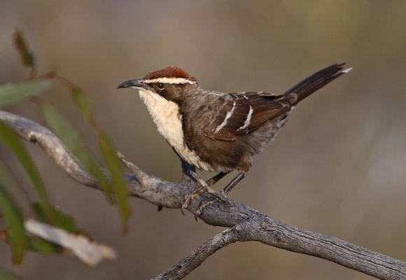

# Challenge modélisation - Prédire le nourrissage des oisillons chez un oiseau fonctionnant en groupes sociaux

Vous arrivez à la fin de la section dédiée à la modélisation statistique au terme de ce cinquième module de Science des Données Biologiques 2. Vous avez maintenant un challenge à relever.

Le pomatostome à calotte marron *Pomatostomus ruficeps* (Hartlaub, 1852), chestnut-crowned babbler en anglais, est un passereau de l'ouest australien. Il vit en groupes sociaux ayant la particularité de coopérer à l'élevage des oisillons : les autres individus du groupe aident les parents à nourrir les jeunes. Votre objectif est de modéliser le taux de nourrissage des oisillons par les adultes en fonction de différents paramètres.

Vous recevez un jeu de données `babblers.rds` dans le dossier `data` reprenant le nombre de nourrissages (`Feeding`) durant la période d'étude pour chaque individu en fonction d'autres variables pour une petite centaine d'oiseaux. Ces variables complémentaires sont :

- `ObsTime` : le temps d'observation en heures décimales
- `Sex` : le sexe de l'individu (`"f"` pour femelle, `"m"` pour mâle)
- `Age` : l'âge de l'individu (`"adult"` ou `"yearling"`)
- `Relatedness` : le degré de parenté avec les oisillons (`"0"`, `"0.25"`, `"0.5"`), plus la valeur est élevée, plus l'individu est proche des oisillons avec 0.5 correspondant à un des parents
- `ChickAge` : l'âge des oisillons en jours
- `BroodSize` : le nombre d'oisillons dans le nid
- `UnitSize` : la taille du groupe social
- `ChickAge2`, `BroodSize2`, `UnitSize2` : les variables précédentes élevées au carré pour votre facilité au cas où vous souhaiteriez utiliser une régression polynomiale

Le challenge consiste à prédire le nourrissage des oisillons en fonction de ces variables. **Le meilleur modèle est choisi en fonction du critère d'Akaike** en utilisant la valeur par défaut de *k* = 2. 

**Lisez bien les instructions ci-dessous et assurez-vous de les avoir bien comprises avant de commencer votre travail !**

Vos propositions doivent être soumises via l'interface dans le cours : soumettez le fichier `.rds` qui est généré dans `/results`. Vous avez un document Quarto `babblers_model.qmd` de départ à compléter pour vous y aider. Vous devez compiler le document au format HTML à l'aide du bouton `Rendu` pour obtenir un fichier de résultat que vous pouvez soumettre. Vous pouvez soumettre autant de modèles que vous voulez, mais **vous devez effectuer un commit pour chaque modèle soumis.** Vos résultats et votre progression seront affichés dans le tableau des scores.
